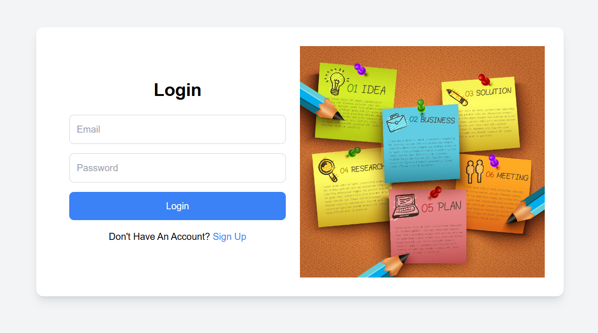
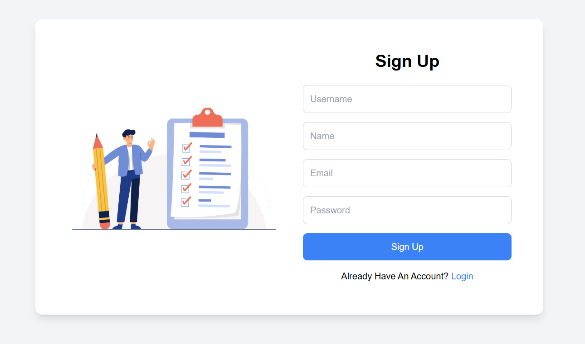
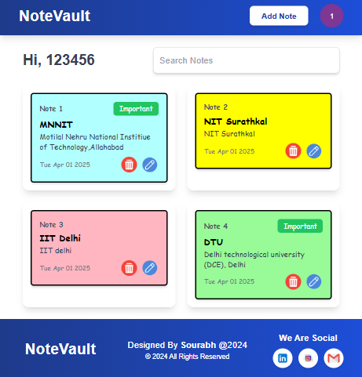
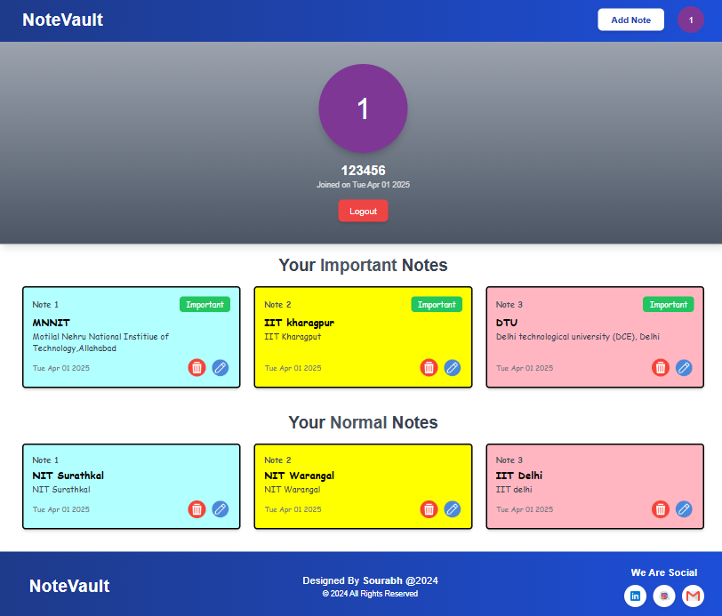
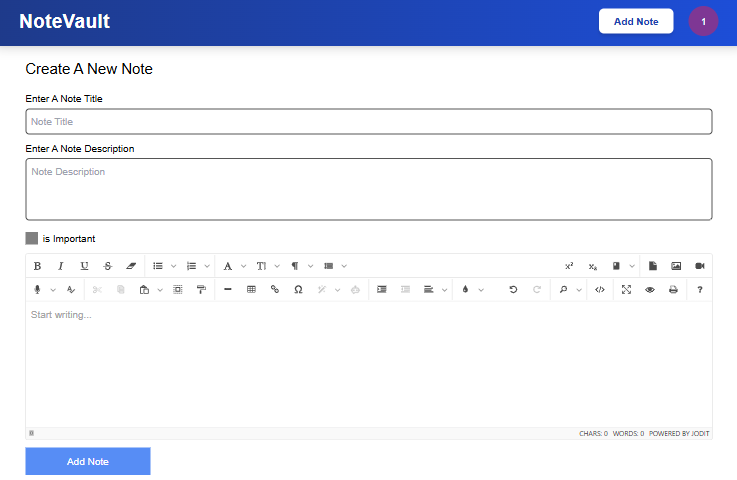
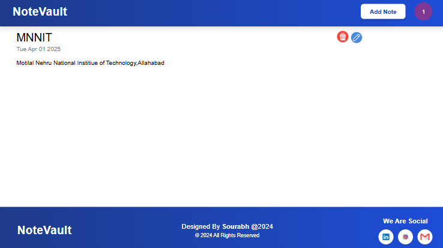
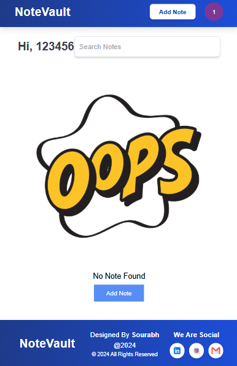
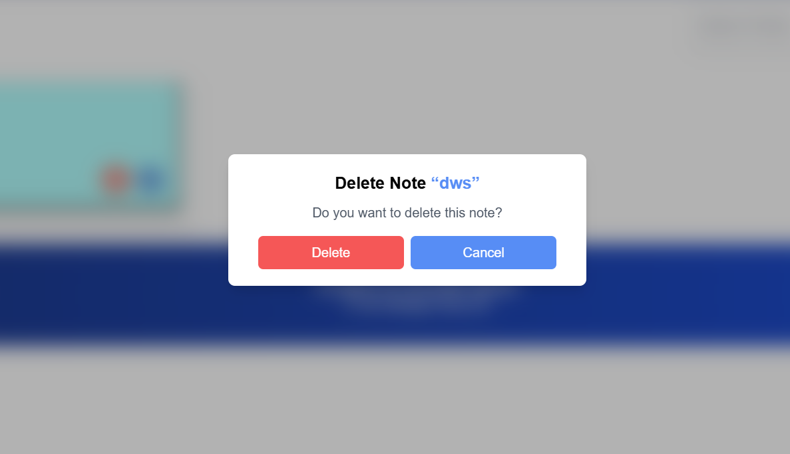

# 🚀 NoteVault - MERN Stack Notes App 📝  

A full-stack **MERN Notes App** with **rich text editing, authentication, and organization features**. This app allows users to create, edit, categorize, and manage notes seamlessly.   

## 🔥 Features  

### 🔑 Authentication & Security  
- **User Registration & Login** – Secure user authentication with encrypted passwords  
- **JWT-based Authentication** – Ensures safe user sessions  

### 📝 Notes Management  
- **Create, Read, Update, Delete (CRUD) Notes** – Manage notes efficiently  
- **Jodit Editor Integration** – Advanced rich text editing with formatting options  

### 🏷️ Categorization & Organization  
- **Important & Normal Notes** – Keep important notes separate from regular ones  
- **Search Functionality** – Quickly find notes by title or content  

### 🎨 UI/UX Enhancements  
- **Avatar Initialization** – Display user initials for a personalized touch  
- **Tailwind CSS Styling** – Modern and responsive design  
- **Add Note Functionality** – Easily create and save new notes  

---

## ⚙️ Tech Stack  

### 🖥️ Frontend  
- **React.js** – Component-based UI  
- **Jodit Editor** – Rich text formatting  
- **Tailwind CSS** – Responsive design  

### 🔧 Backend  
- **Node.js & Express.js** – API handling  
- **MongoDB & Mongoose** – Database storage  

### 🛠️ Dev Tools  
- **JWT for Authentication**  
- **bcrypt for Password Hashing**  
- **Multer for File Uploads**  

---

## Deployment 🌍

🚀 Live Demo: [NoteVault](https://sourabhnotevault.vercel.app/)

---

## 📸 Website View  

| Login | SignUp | DashBoard/Home | Profile | Add Note | SingleNotePage | NoPage | Delete |
|------------|----------------|------------------|---------|-----------|--------------|--------|--------|
|  |  |  |  |  |  |  |  |


---

## 🚀 Getting Started  

### 📌 Installation  

1. **Clone the Repository**  
   ```sh
   git clone https://github.com/yourusername/mern-notes-app.git
   cd NotePad
2. **Frontend**
   ```sh
   cd frontend
   npm install
   npm start
3. Backend
   ```sh
   cd backend
   npx nodemon
